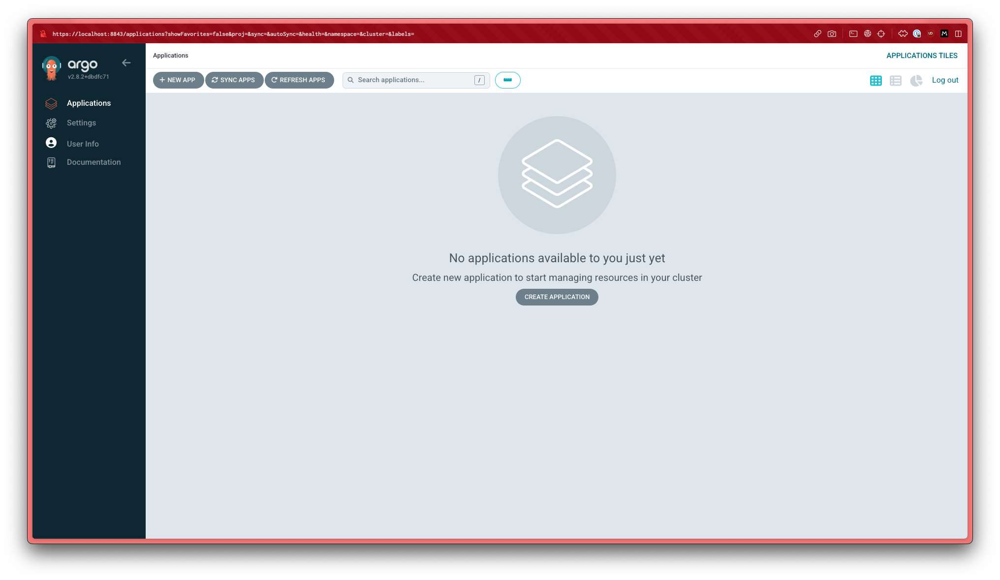
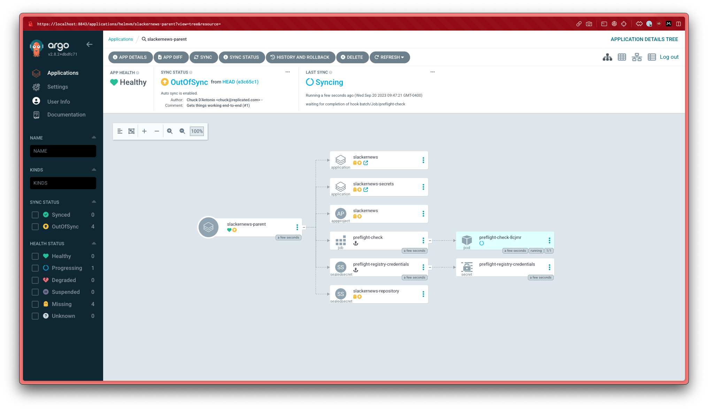
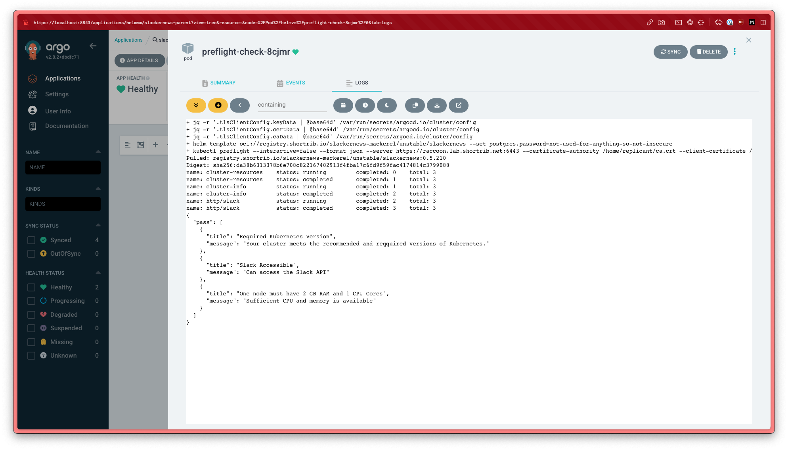
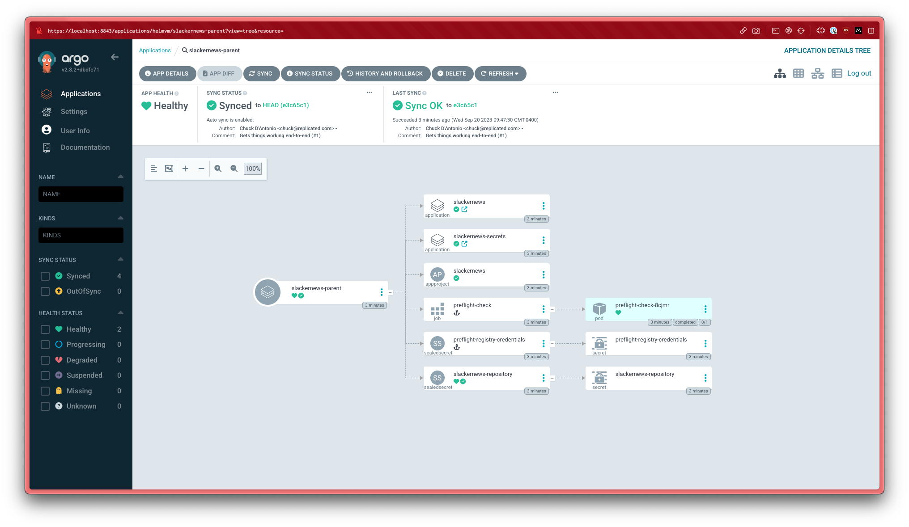
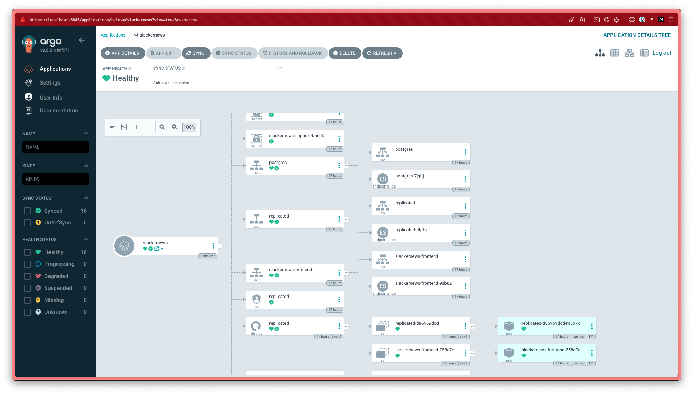
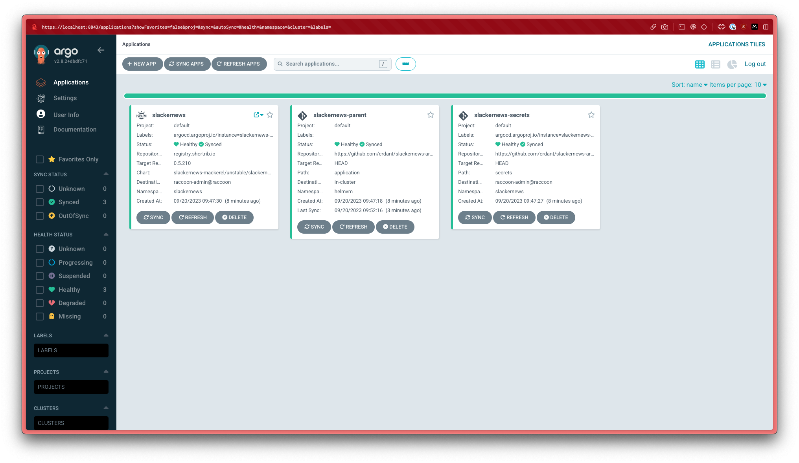

# GitOps with Argo CD, Helm, and Replicated KOTS

This repository contains the code and configuration needed to 
demonstrate GitOps deployment of a [KOTS](https://kots.io) 
app with [Argo CD](https://argo-cd.readthedocs.io/en/stable/).

## Scenario

The demonstration considers a context in which a team is using
Replicated KOTS to distribute their application and a customer
requires a GitOps deployment using Argo CD. The current 
iteration assumes that Argo CD is running in a different cluster
from the workload, but can work with a single cluster as well.

The demo application I've used is [SlackerNews](https://slackernews.io/), a
cool app we've built to show off Replicated. Think of it as Hacker News, but
for internal teams. Automatically, populated by your Slack's links shared,
replies and reactions. It's fully private, self-hosted, and open source.

I've combined a few different features of Replicated and Argo CD to 
deliver this demo.

* Preflight checks built with [Troubleshoot](https://troubleshoot.sh) to assure
  my workload cluster is ready to run the application
* Replicated's vendor portal, registry proxy, and registry which [distribute
  the Slackernews application as a Helm
  chart](https://docs.replicated.com/vendor/distributing-overview)
* The Replicated [custom
  domain](https://docs.replicated.com/vendor/custom-domains)
  capabilities.
* Argo CD [resource
  hooks](https://argo-cd.readthedocs.io/en/stable/user-guide/resource_hooks/)
  to assure that my preflight checks run before the application installs.

## Running the demonstration

To run the demonstration, you will need to fork this repository.
I hate having to ask you that, but it's required since my cluster
address and sealed secrets woon't work with your repository. You'll
customize these and commit them to your fork.

Once you've forked the repo, you can use the provided `Brewfile` to
install some helpful CLIs (assuming you have Homebrew). If you don't
have Homebrew you should install [`kubeseal`](https://github.com/bitnami-labs/sealed-secrets#installation) 
and [`yq`](https://github.com/mikefarah/yq#install), and might also 
want the [`argocd`](https://argo-cd.readthedocs.io/en/stable/getting_started/#2-download-argo-cd-cli)
CLI though I'm not using it explicitly in the demonstration.

You'll also need two Kubernetes clusters, one with Argo CD installed and
another to deploy the application. I had the clusters already configured,
ArgoCD is running in a [HelmVM](https://github.com/replicatedhq/helmvm)-based
virtual appliance created with Replicated, while the second cluster is a [k0s](
cluster](https://k0sproject.io) I built with [some automation I use for that
sort of thing](https://github.com/shortrib-labs/k0s-cluster).  Any clusters will
do.

To fully install and run the application, you have to set up Slackernewws as an
application in your Slack team (or one you use for development and
demoonstrations). See the [setup
instructions](https://docs.slackernews.io/slack/) in the docs for Slackernews.

The last thing you'll need is access to the SlackerNews application as a
Replicated application. Drop me a line or go to
[slackernews.io](https://slackernews.io) to get a community license.

### Setup Steps

The setup is a bit tedious, but not particularly complex. At a high-level, 
you're going to fork this repo, make sure the manifests refer to your fork
and reseal your secrets.

1. Fork this repo. Come back to this point in the README of your fork.

2. Make sure you have all the provided CLIs installed, if you're using Homebrew:

```
brew bundle install
```

otherwise follow the instructions for each CLI:

* [`kubeseal`](https://github.com/bitnami-labs/sealed-secrets#installation) 
* [`yq`](https://github.com/mikefarah/yq#install)

3. Update the manifest for the secrets application so that it references
   your repo fork and your workload cluster:

   ```
   yq -i '.spec.source.repoURL = "$FORKED_REPO_URL"' application/secrets.yaml
   yq -i '.spec.destination.server = "$WORKLOAD_ENDPOINT"' application/secrets.yaml 
   ```

4. Update the manifest for the SlackerNews application so that it references
   your destination cluster:

   ```
   yq -i '.spec.destination.server = "$WORKLOAD_ENDPOINT"' application/application.yaml 
   ```

5. Recreate the secrets used to access the Replicated registry. These secrets should be 
   sealed for the cluster running Argo CD.
   
   You'll need the username, password, and server address for the registry. If you're 
   using your own vendor account, create a customer license and get the username, password, 
   and registry server from the Helm install steps. If I provided you with a license, I'll 
   send you the credentials. 

   ```
   # to enable accesss to the preflight checks
   kubectl create secret docker-registry preflight-registry-credentials \
       --dry-run=client -o yaml -n argocd --docker-username $REGISTRY_USERNAME 
       --docker-password $REGISTRY_PASSWORD --docker-server $REGISTRY_SERVER \
     | kubeseal -n argocd > application/preflight-registry-credentials.yaml

   # to enable access to the HElm chart
   kubectl create secret generic slackernews-repository --dry-run=client -o yaml \
       -n argocd --from-literal=enableOCI=true --from-literal=username=$REGISTRY_USERNAME \
       --from-literal=password=$REGISTRY_PASSWORD --from-literal=url=$REGISTRY_SERVER \
       --from-literal=type=helm --from-literal=name=slackernews \
     | kubeseal -n argocd -o yaml > application/slackernews-repository.yaml
   ```

6. Recreate the secrets used by the SlackerNews application. These secrets should be sealed
   against the workload cluster. You'll need to create a namespace named `slackernews` in 
   order to properly seal the secrets.

   ```
   # create namespace
   kubectl create ns slackernews

   # create secret for the postgres database
   kubectl create secret generic slackernews-postgresql -n slackernews \
       --dry-run=client -o yaml --from-literal=password=$USER_PASSWORD \
     | kubeseal -n slackenews -o yaml > secrets/slackernews-postgresql.yaml   
   # create secret for the Slack app
   kubectl create secret generic slackernews-slack -n slackernews \
       --dry-run=client -o yaml --from-literal=clientId=$SLACK_CLIENT_ID \
       --from-literal=clientSecret=$SLACK_CLIENT_SECRET \
       --from-literal=botToken=$SLACK_BOT_TOKEN \
       --from-literal=userToken=$SLACK_USER_TOKEN \
     | kubeseal -n slackernews -o yaml > secrets/slackernews-slack.yaml

   # delete the slackernews namespace so we can show Argo creating it
   kubectl delete ns slackernews
   ```

7. Commit all your changes and push them to GitHub.

### Demonstration Steps

After all that setup, the demonstration is fairly straightforward. You're going to
tell Argo to do it's thing, showing the progress as it goes.

1. Open a terminal and show the namespaces on your workload cluster along with the 
   (non-existant) workloads in the `slackernews` namespace. I like to keep this running
   the whole time. I also make the context explicit because I'll be running other
   commands against the Argo CD cluster.

   ```
   watch kubectl get --context $WORKLOAD_CLUSTER_CONTEXT --namespace slackernews all,ns
   ```

2. Open a browser window to the application tiles on your Argo CD installation.

   

3. Start the installation.

   ```
   kubectl apply -f slackernews-parent.yaml
   ```

4. Switch back to the browser window and click into the application
   `slackernews-parent`. The preflight checks may have started running. If they
   haven't wait for them to start.

   

6. Show the logs to see that the preflights have started and/or passed.

   

7. Close out the logs and wait until the preflights have completed. They may already 
   have done so 

   

8. Point out that the preflights are complete and that he secrets and
   application have synced and started progressing. Move back to the
   application tiles screen and check whether the application has completed.

9. Click into the `slackenews` application to show the details. If it's still
   progressing, use the time to go through the manifests to explain how this
   demonstration came together.

   

10. When progress is complete, point out the fully snyced and healthy tiles.

   
